----

# Ray Casting Explanation

## Disclaimer

In this documentation, I'm going to explain the logic I found for a simple ray caster.
This is in no way the most optimized version, but it's what worked and what I understood.

My English is not best, so sorry in advance if it's not clear. 

With that out of the way, let's start.

---

# Table of Content
- [Ray Casting Explanation](#ray-casting-explanation)
	- [Disclaimer](#disclaimer)
- [Table of Content](#table-of-content)
- [1. The basic idea, Ray casting at it's core](#1-the-basic-idea-ray-casting-at-its-core)
- [2. A 2D map game with a flashlight](#2-a-2d-map-game-with-a-flashlight)
	- [Math notations](#math-notations)
	- [$y\_{Intercept}$ first step](#y_intercept-first-step)
	- [$x\_{Intercept}$ first step](#x_intercept-first-step)
	- [Get Next Step](#get-next-step)
	- [Get $y\_{Intercept}$ next step](#get-y_intercept-next-step)
	- [Get $x\_{Intercept}$ next step](#get-x_intercept-next-step)
	- [Get Intersection](#get-intersection)
- [3. Let's add walls](#3-lets-add-walls)
- [4. The floor, the ceiling and the skybox](#4-the-floor-the-ceiling-and-the-skybox)
- [5. Transparency ?!?](#5-transparency-)
- [6. Sources](#6-sources)

---

# 1. The basic idea, Ray casting at it's core

Ray casting is a method of generating a 2.5D world. *(2.5D : A game that looks 3D but can only be played in 2D)*  
It is a simplification of Ray tracing, where Ray tracing calculates for each pixel the direction of light coming in, a ray caster puts limitation in the world to simplify the calculations, so it can calculate only column by column instead of pixel by pixel.

The two limitation make the game in 2 dimensions, in which the world is subdivided in squares.  
We simplify the 3D to be rendered has a 2D game, then stretch the wall to appear in 3D.

<!-- It may appear still a bit confusing but don't worry it's only a vague Explanation, we'll go into the detail in the later chapters.  
All you need to know is the general process of the ray caster which is : -->

---

# 2. A 2D map game with a flashlight

The first step in our adventure towards 3D is to draw a single line across the screen, with all the intersection of the wall at the middle point. Seems complicated, but it's not.

For each pixel you get the intersection of the wall and print the corresponding texture of the given wall. The keyword in the last sentence being intersection.  

In the first place, our ray caster will get the intersection of a wall given a player position and angle.

This can be difficult to visualize, so instead of going straight in 3D will do a detour towards 2D and draw a flashlight for a 2D game. It essentially the same thing for the 3D game, we would need to draw the map then draw the light emitted by the flashlight until it intersect with a wall.


For simplification, we will divide the task in smaller ones and draw only a single ray instead of a lot for a flashlight.

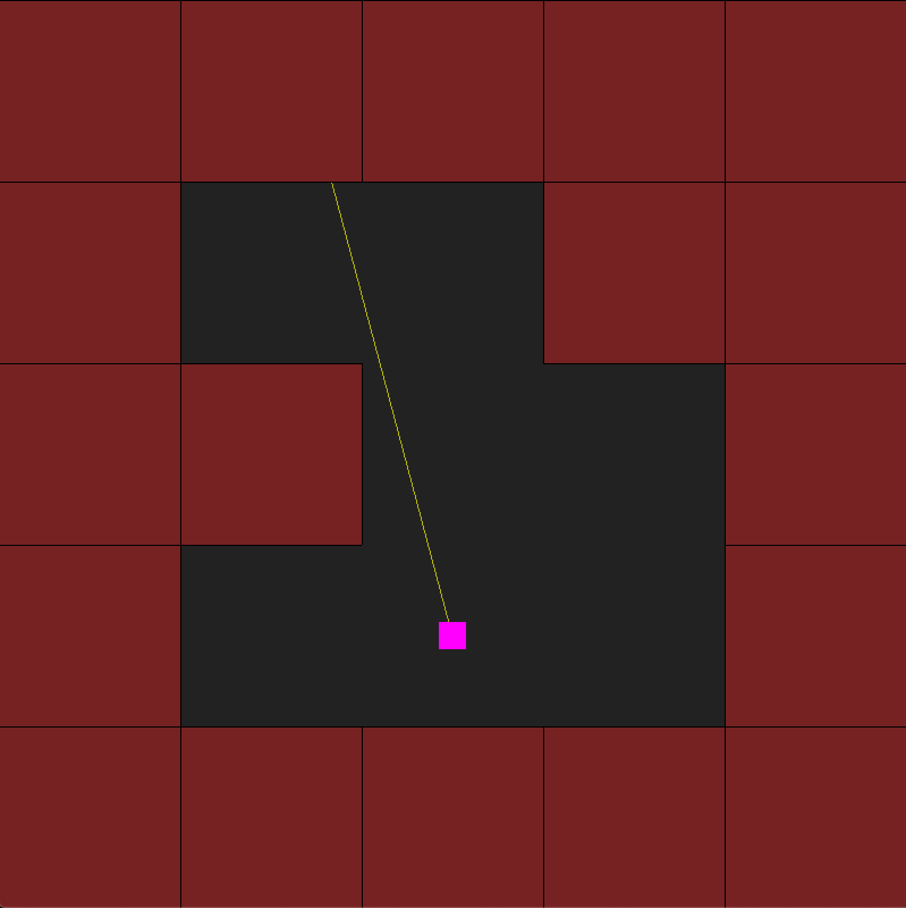

Our ray can be even more simplified as a line between two points.

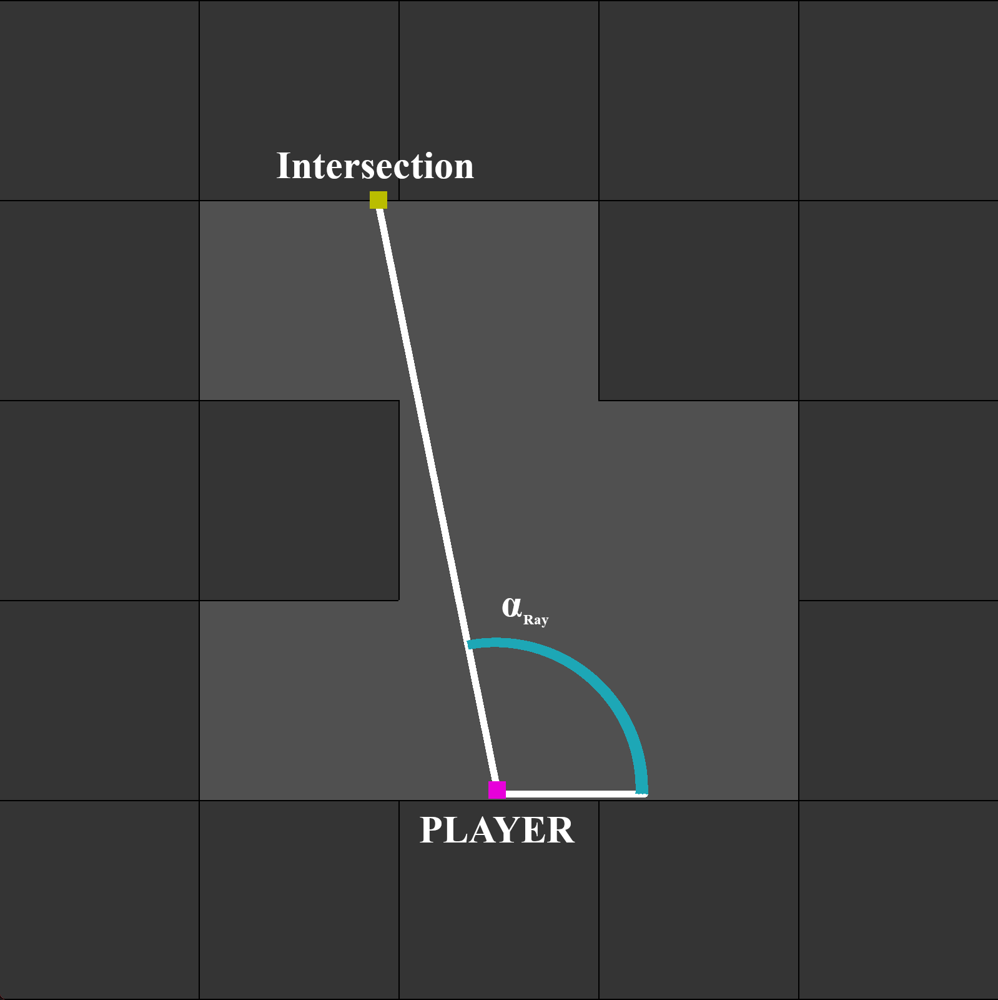

What we want to find is $(X_{inter}, Y_{inter})$, the coordinates of Intersection.

We know :  
- $(X_{player}, Y_{player})$, the coordinates of the player  
- $\alpha_{ray}$, the direction of the ray  

To find the intersection, we will use the rules we set earlier. We know the map is a grid, so that mean our intersection is on one of the edges of a square.  
That means that the point of intersection has to be on either a horizontal line with a round $y$ or a vertical line with a round $x$.

So, the intersection is either on a blue or green line.


That mean we can divide our process in two: $X_{Intercept}$ and $Y_{Intercept}$.

We can also subdivide the process in two major sections. The first occurrence and all those that follow.

## Math notations

Quickly, before the math comes in,

$\left(x \atop y \right)$ is the notation for a set of coordinate.

$\overline{AB}$ is the distance between $A$ and $B$.  
$A_x$ is the coordinate $x$ of the point $A$  
$A_y$ is the coordinate $y$ of the point $A$  
$inter(i)$ is the point represented by the function $inter()$ iterated a $i$ number of times  
$\pm$ is plus or minus

## $y_{Intercept}$ first step


<details open><summary>Definitions</summary><blockquote>

$P'$ is a point in the corner of the square where the player is.  
$\Delta x$ is difference between $| P_x' - P_x|$  
$\Delta y$ is difference between $| P_y' - P_y|$  

**/!\ Warning /!\\**  
$P'$ position will vary in function in which direction the player faces.  
Then $\Delta x$ and $\Delta y$ will do so as well.

</blockquote></details>

<details open><summary>Math Explanations</summary><blockquote>

We need to find $yInter$, but we already know it's $y$ value, it is the same $y$ as $P'$.

So

$$yInter = (yInter_x, p_y')$$

The only needed value then is $yInter_x$.

We can see that :

$$yInter_x = P_y' + \overline{P'\ yInter}$$

but we can see on the graph that

$$\overline{P'\ yInter} = \Delta x - \overline{A\ yInter}$$

so

$$yInter_x = P_y' + \Delta x - \overline{A\ yInter}$$

So to find $yInter_x$ we need to find $\overline{A\ yInter}$ which is confidently a side of the triangle formed by $yInter$, > $Player$ and $A$.  

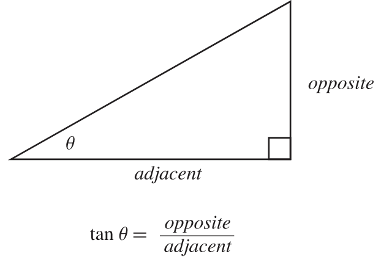

With $tan(\alpha) = \dfrac{opposite}{adjacent}$, we can determine that

$$\overline{A\ yInter} = \Delta y . tan(\alpha_{ray})$$

and so

$$yInter_x = P_y' + \Delta x - \Delta y . tan(\alpha_{ray})$$

but

$$P_y' + \Delta x = P_x$$

In conclusion, we have that

$$yInter = \left(P_x - \Delta y . tan(\alpha_{ray}) \atop P_y' \right)$$

</blockquote></details>

<details open><summary>Program Explanations</summary><blockquote>

Now that we know the formula to calculate the first point of intersection. We see that we know $\alpha_{ray}$ and $P_x$ but only have a description of what $P_y'$ and $\Delta y$ are.

We know that in the example in our graph that $P'$ is simply equal to a cast to an integer of $P$

```c
float P_prime_y = (int) player_y;
```

But that only is the case when the player is looking to the North, or in more precise terms :   
$\alpha_{ray}$ is between $0^\circ$ and $180^\circ$ or between $0$ and $\pi$ radian. 

```c
if (0 < alpha_ray && alpha_ray <= 180)
	float P_prime_y = (int) player_y;
else
	float P_prime_y = (int) player_y + 1;
```

or a bit better

```c
float P_prime_y = (int) player_y;
if (180 < alpha_ray && alpha_ray <= 360)
	P_prime_y += 1;
```

We now know the value of $P_y'$. We only need $\Delta y$, for that we can simply use the formula in the definitions.

```c
float delta_y = abs(player_y - P_prime_y);
```

Now, we have everything to calculate $y_{Inter}$ with our formula :  

$$yInter = \left(P_x - \Delta y . tan(\alpha_{ray}) \atop P_y' \right)$$

```c
float yInter_x = player_x - delta_y * tan(alpha_ray);
float yInter_y = P_prime_y;
```

We finally have the first point of intersection to a line where y is round.

</blockquote></details>

## $x_{Intercept}$ first step

The math explanation is almost the same as $Y_{Intercept}$ init, but some value exchanged. So I'll answer on the question you may have, if the first intersection is out of the first square.
You'll see it works the same.  
<!-- The only thing you need to know before hand is that a distance $\overline{AB}$ can go in the negative. -->

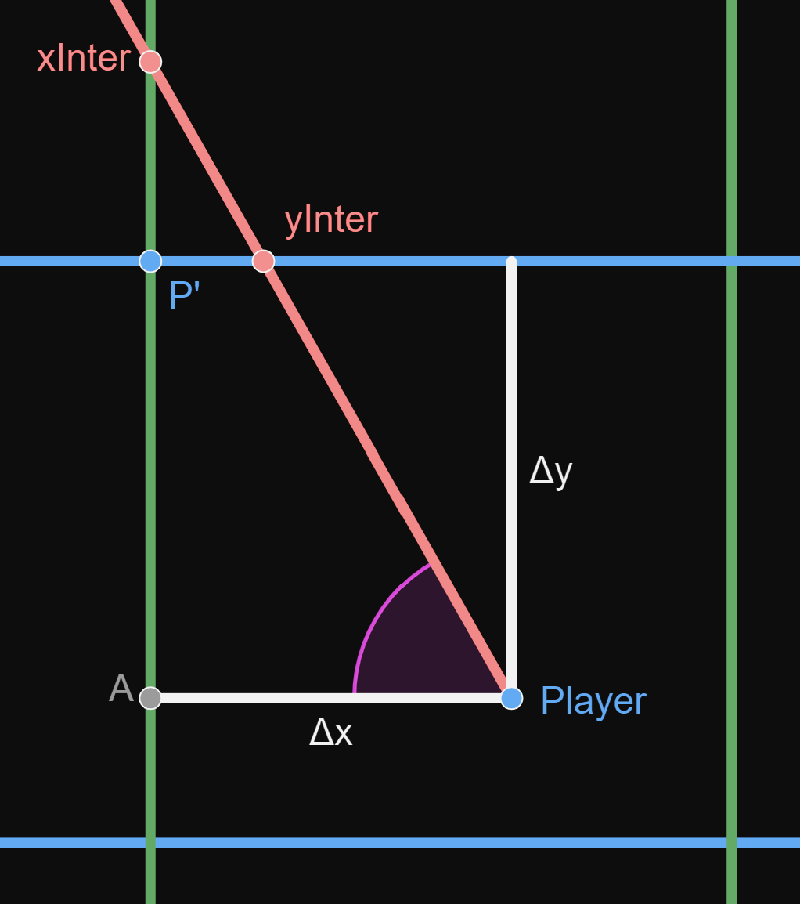

<details open><summary>Definitions</summary><blockquote> 

$P'$ is a point in the corner of the square where the player is.  
$\Delta x$ is difference between $| P_x' - P_x|$  
$\Delta y$ is difference between $| P_y' - P_y|$  

**/!\ Warning /!\\**  
$P'$ position will vary in function in which direction the player faces.  
Then $\Delta x$ and $\Delta y$ will do so as well.

</blockquote></details>

<details open><summary>Math Explanations</summary><blockquote> 


We need to find $xInter$, but we already know it's $x$ value, it is the same $x$ as $P'$.  
So 

$$xInter = (p_x', xInter_y)$$  

The only needed value then is $xInter_y$.

We can see that :  
$$xInter_y = P_y' - \overline{P'\ xInter}$$

but we can see on the graph that

$$\overline{P'\ xInter} = \overline{A\ xInter} - \Delta y$$ 

so

$$xInter_y = P_x' - (\overline{A\ xInter} - \Delta y)$$

*The trick for if it's outside is here. With a double negative, the formula can be simplified.*

$$xInter_y = P_x' + \Delta y - \overline{A\ xInter}$$

So to find $xInter_y$ we need to find $\overline{A\ xInter}$ which is convinently a side of the triangle formed by $xInter$, $Player$ and $A$.  


With $tan(\alpha) = \dfrac{opposite}{adjacent}$, we can determine that  
$$\overline{A\ xInter} = \dfrac{\Delta x}{tan(\alpha_{ray})}$$ 

and so  

$$xInter_y = P_x' + \Delta y - \dfrac{\Delta x}{tan(\alpha_{ray})}$$

but
$$P_y' + \Delta y = P_y$$

In conclusion, we have that  

$$xInter = \left(P_x' \atop P_y - \dfrac{\Delta x}{tan(\alpha_{ray})} \right)$$

</blockquote></details>

<details open><summary>Program Explanations</summary><blockquote> 

Now that we know the formula to calculate the first point of intersection. We see that we know $\alpha_{ray}$ and $P_x$ but only have a description of what $P_x'$ and $\Delta x$ are.

We know that in the example in our graph that $P'$ is simply equal to a cast to an integer of $P$

```c
float P_prime_x = (int) player_x;
```

But it's only the case when the player looking to the West, or in more precise terms :   
$\alpha_{ray}$ is between $90^\circ$ and $270^\circ$ or between $\dfrac{\pi}{2}$ and $\dfrac{3\pi}{2}$ radian. 

```c
if (90 < alpha_ray && alpha_ray <= 270)
	float P_prime_x = (int) player_x;
else
	float P_prime_x = (int) player_x + 1;
```

Or a bit better

```c
float P_prime_x = (int) player_x;
if (!(90 < alpha_ray && alpha_ray <= 270))
	P_prime_x += 1;
```

We now know the value of $P_x'$. We only need $\Delta x$, for that we can simply use the formula in the definitions.

```c
float delta_x = abs(player_x - P_prime_x);
```

Now, we have everything to calculate xInter $x_{Inter}$ with our formula :  

$$xInter = \left(P_x' \atop P_y - \dfrac{\Delta x}{tan(\alpha_{ray})} \right)$$

```c
float xInter_x = P_prime_x;
float xInter_y = player_y - delta_x * tan(alpha_ray);
```

We finally have the first point of intersection to a line where x is round.

</blockquote></details>

## Get Next Step

Now that we have found the first intersection for both $x$ and $y$ axis, we need to create a function that take an intersection and gets you the next one for both axis.

## Get $y_{Intercept}$ next step

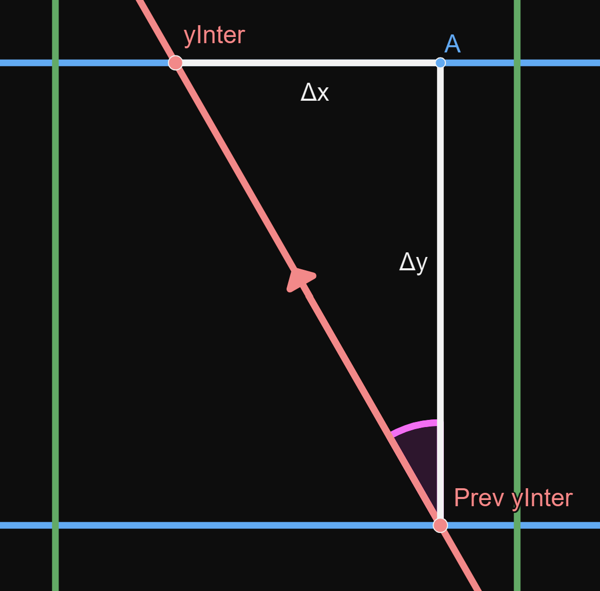
 
<details open><summary>Definitions</summary><blockquote> 

For readability, i will refer to :
- "prev yInter" as $yInter(i)$
- "yInter" as $yInter(i + 1)$  

$\Delta x$ is difference between $| yInter(i)_x - yInter(i+1)_x |$  
$\Delta y$ is difference between $| yInter(i)_y - yInter(i+1)_y |$  

</blockquote></details>

<details open><summary>Math Explanations</summary><blockquote> 

We need to get $yInter(i+1)$ and we know $yInter(i)$ and $\alpha_{ray}$

We can see on the graph that : 

$$yInter(i+1) = \left(yInter(i)_x - \Delta x \atop yInter(i)_y - \Delta y \right)$$

but that is only valid if we are looking North-West. The sign of both $\Delta$ will vary in function of the angle we are looking at. I'm going to make the function with a $\pm$ but in the program section we will solve this issue.

We have then : 
$$yInter(i+1) = \left(yInter(i)_x \pm \Delta x \atop yInter(i)_y \pm \Delta y \right)$$

We need to calculate both $\Delta$ but we can see that $\Delta y$ is equal to $1$ which makes sense because we need to find the next intersection with the line where $y = a + 1, a \in R^+$ from the intersection with the line where $y = a, a \in R^+$.

So the only value missing is $\Delta x$ but we can it inside triangle made by the point $A$, $yInter(i)$ and $yInter(i+1)$. So we can use our favorite trick : trigonometry.  


With $tan(\alpha) = \dfrac{opposite}{adjacent}$, we can determine that 

$$\Delta x = \Delta y . tan(\alpha_{ray})$$

With that done, we now know that

$$yInter(i+1)_x = yInter(i)_x \pm \Delta y \cdot \tan(1)$$

but earlier we said that $\Delta y = 1$, so

$$yInter(i+1)_x = yInter(i)_x \pm \tan(\alpha_{ray})$$

And finally, 

$$yInter(i+1) = \left(yInter(i)_x \pm \tan(\alpha_{ray}) \atop yInter(i)_y \pm 1 \right)$$

</blockquote></details>

<details open><summary>Program Explanations</summary><blockquote> 

We now have the formula to get the next intersection of line where y is round. But to compute it we have to get rid of this $\pm$.

For that, we observe that we need to subtract $\Delta x$ if we are looking in the west and add if we are looking east.  
The west being if $\alpha_{ray}$ is between $90^\circ$ and $270^\circ$ or between $\dfrac{\pi}{2}$ and $\dfrac{3\pi}{2}$ radian.

We will use this knowledge and our formula to compute it.

$$yInter(i+1)_x = yInter(i)_x \pm tan(\alpha_{ray})$$

```c
float deltaX = tan(alpha_ray);

if (90 < alpha_ray && alpha_ray <= 270)
	float yInter_next_x = yInter_prev_x - deltaX;
else
	float yInter_next_x = yInter_prev_x + deltaX;
```

We have the $x$, now we need the $y$ except this time we add if we are looking south and subtract if we are looking north.  
The north being if $\alpha_{ray}$ is between $0^\circ$ and $180^\circ$ or between $0$ and $\pi$ radian.

And with our formula, 

$$yInter(i+1)_y = yInter(i)_y \pm 1$$

```c
if (0 < alpha_ray && alpha_ray <= 180)
	float yInter_next_y = yInter_prev_y - 1;
else
	float yInter_next_y = yInter_prev_y + 1;
```

With that done, we have finished a step.

</blockquote></details>


## Get $x_{Intercept}$ next step

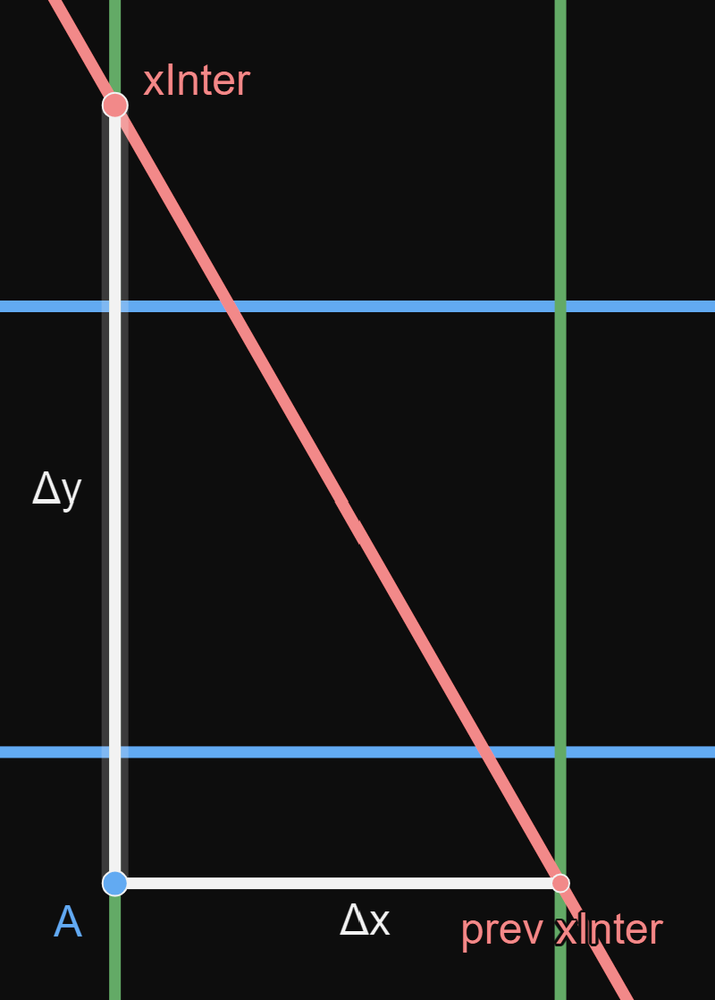
 
<details open><summary>Definitions</summary><blockquote> 

For readability, i will refer to :
- "prev yInter" as $yInter(i)$
- "yInter" as $yInter(i + 1)$  

$\Delta x$ is difference between $| xInter(i)_x - xInter(i+1)_x |$  
$\Delta y$ is difference between $| xInter(i)_y - xInter(i+1)_y |$  

</blockquote></details>

<details open><summary>Math Explanations</summary><blockquote> 

We need to get $xInter(i+1)$ and we know $xInter(i)$ and $\alpha_{ray}$

We can see on the graph that :  

$$xInter(i+1) = \left(xInter(i)_x - \Delta x \atop xInter(i)_y - \Delta y \right)$$

But that is only valid if we are looking North-West. The sign of both $\Delta$ will vary in function of the angle we are looking at. I'm going to make the function with a $\pm$ but in the program section we will solve this issue.

We have then :  
$$xInter(i+1) = \left(xInter(i)_x \pm \Delta x \atop xInter(i)_y \pm \Delta y \right)$$

We need to calculate both $\Delta$ but we can see that $\Delta x$ is equal to $1$ which makes sense because we need to find the next intersection with the line where $x = a + 1, a \in R^+$ from the intersection with the line where $x = a, a \in R^+$.

So the only value missing is $\Delta y$ but we can it inside triangle made by the point $A$, $xInter(i)$ and $xInter(i+1)$. So we can use our favorite trick : trigonometry.  


With $tan(\alpha) = \dfrac{opposite}{adjacent}$, we can determine that 

$$\Delta y = \dfrac{\Delta x}{tan(\alpha_{ray})}$$

With that done, we now know that

$$xInter(i+1)_y = xInter(i)_y \pm \dfrac{\Delta x}{tan(\alpha_{ray})}$$

but earlier we said that $\Delta y = 1$, so

$$xInter(i+1)_y = xInter(i)_y \pm \dfrac{1}{tan(\alpha_{ray})}$$

And finally, 

$$xInter(i+1) = \left(xInter(i)_x \pm 1 \atop xInter(i)_y \pm \dfrac{1}{tan(\alpha_{ray})} \right)$$

</blockquote></details>

<details open><summary>Program Explanations</summary><blockquote> 

We now have the formula to get the next intersection of line where y is round. But to compute it, we have to get rid of this $\pm$.

For that, we observe that we need to subtract $\Delta x$ if we are looking in the west and add if we are looking east.  
The west being if $\alpha_{ray}$ is between $90^\circ$ and $270^\circ$ or between $\dfrac{\pi}{2}$ and $\dfrac{3\pi}{2}$ radian.

We will use this knowledge and our formula to cumpute it.

$$xInter(i+1)_x = xInter(i)_x \pm 1$$

```c
if (90 < alpha_ray && alpha_ray <= 270)
	float xInter_next_x = xInter_prev_x - 1;
else
	float xInter_next_x = xInter_prev_x + 1;
```

We have the $x$, now we need the $y$ except this time we add if we are looking south and subtract if we are looking north.  
The north being if $\alpha_{ray}$ is between $0^\circ$ and $180^\circ$ or between $0$ and $\pi$ radian.

And with our formula, 

$$xInter(i+1)_y = xInter(i+1)_y \pm \dfrac{1}{tan(\alpha_{ray})}$$

```c
float deltaY = 1 / tan(alpha_ray)

if (0 < alpha_ray && alpha_ray <= 180)
	float xInter_next_y = xInter_prev_y - deltaY;
else
	float xInter_next_y = xInter_prev_y + deltaY;
```

With that done, we have finished an another step.

</blockquote></details>

## Get Intersection

We have gained a way to get both first intersection and both next steps.
Now we need to finalize the get Intersection function.

You can to do it in two ways.

<details open><summary>Simple/Naive Way</summary><blockquote> 

It is simple because it requires not much more than what we have.

We to create two loops, one to get the first intersection of a wall on an X axis and one on a Y axis.

Then we compare the distance of each wall and see which is the closest one, this is our intersection.

*Why is this naive ?*

Let's image a map like this :

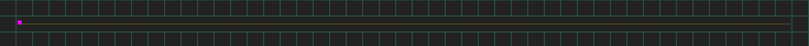

What would our two loops get us ? The interception of y-axis find a wall in two steps but the problem is the interception of x-axis it has no answer. It will loop until either it is out of the map if you have a check, but if not... it will loop for infinity.

It means, we have an answer but can't use it because our other loops never stop.
To fix it, the solution, which I mentioned above, is to stop the loops if it goes out of the map. But still leaves us with a solution a $y_{Inter(2)}$ and no solution at $x_{Intercept(25)}$.

We did 25 steps for something not needed, which is a waste.

Code example :

```c
typedef struct s_point
{
	float x;
	float y;
}	t_point;

t_map *map;
t_point player;
float player_alpha;

t_point get_intersection(float ray_alpha)
{
	t_point xInter = xInter_init(ray_alpha);
	while (!has_found_a_wall(xInter))
		xInter = xInter_step(xInter, ray_alpha);

	t_point yInter = yInter_init(ray_alpha);
	while (!has_found_a_wall(yInter))
		yInter = yInter_step(yInter, ray_alpha);

	if (distance(player, xInter) < distance(player, yInter))
		return (xInter);
	return (yInter);
}
```

</blockquote></details>

<details open><summary>More optimized way</summary><blockquote> 

The more optimized way is to only do the closest one step from the player, if the closest one is a wall you stop.

```c
typedef struct s_point
{
	float x;
	float y;
}	t_point;

t_map *map;
t_point player;
float player_alpha;

t_point get_intersection(float ray_alpha)
{
	t_point xInter = xInter_init(ray_alpha);
	t_point yInter = yInter_init(ray_alpha);

	while (1)
	{
		if (distance(player, xInter) < distance(player, yInter))
		{
			if (has_found_a_wall(xInter))
				return (xInter);
			xInter = xInter_step(xInter, ray_alpha);
		}
		else
		{
			if (has_found_a_wall(yInter))
				return (yInter);
			yInter = yInter_step(yInter, ray_alpha);
		}
	}
}
```

</blockquote></details>

<details open><summary>Optimization for the Distance</summary><blockquote> 

You might have seen the distance() function and imagined it to be a simple distance between two points.

$$d(A,B) = \sqrt{(A_x - B_x)^2 + (A_y - B_y)^2}$$

but this function use a square root which is a heavy operation and is only used to compare with another distance. This means that our distance function can simpler if we simply us find which is the furthest.

First we can remove the square root as it the the heaviest operation.

$$d'(A,B) = (A_x - B_x)^2 + (A_y - B_y)^2$$

Then whe can remove the square as it only exagerate our value but we have to keep the sign positives so

$$d'(A,B) = |A_x - B_x| + |A_y - B_y|$$

this is much better for our use here.

</blockquote></details>

## Back to rays

Now the that we have the get_intersection() function, we can simply use to draw a line for each ray for flashlight.

```c
typedef struct s_point
{
	float x;
	float y;
}	t_point;

t_point player;
float player_alpha;

void draw_flashlight()
{
	float alpha = player_alpha - 30;
	while (alpha <= player_alpha + 30)
	{
		t_point intersection = get_intersection(alpha);
		draw_line(player, intersection);
		alpha += 1;
	}
}
```

---

# 3. Let's add walls

We have made a 2d map game great right... Oh yeah we are missing a dimension.  
Lets add it. 

In the intro, I talked about streching our 2d map game this is where we'll do it.


// TODO explain 2d expansion with gif


## Our main loop

The main loop of our 3d game is the first step in our 3d game.  
We know that all our step will be done in column. For each pixel on the screen we will need the angle associated with that pixel.

$$\alpha_{step} = \dfrac{FOV}{win_{width}}$$

We know that the angle in the middle is $\alpha_{player}$. The angle for the first and last pixel is also simple.

$$\alpha_{start} = \alpha_{player} - \dfrac{FOV}{2}$$
$$\alpha_{end} = \alpha_{player} + \dfrac{FOV}{2}$$

With that information, we can make our main loop.

```c
int win_width;

float player_alpha;

float fov = 60;
float fov_incrementation = fov / win_width;

void	draw_3d()
{
	float alpha = player_alpha - fov / 2
	for(int pixel = 0; pixel < win_width; pixel++)
	{
		draw_column(alpha, pixel);
		alpha += fov_incrementation;
	}
}

```

## Draw our column

Now that we have our draw_column() function to write.

We know the angle at which we are looking, this is the first argument we received.  
The first thing we can do is to get the wall intersection using our get_intersection() function. 

```c
t_point intersection = get_intersection(alpha);
```

We know that our player cannot be looking up our down, that means our wall is a line that has its center in middle of the screen, or that the line of the wall we will draw has its two extremities be
$$pixel_{top} = \dfrac{win_{height}}{2} + \dfrac{wall_{height}}{2}$$
$$pixel_{bottom} = \dfrac{win_{height}}{2} - \dfrac{wall_{height}}{2}$$

That means that to know the top and the bottom pixel we only need to know the height of the wall.

By logic, we know that our wall height is dependent of the distance of the wall. The further away the wall is the small it is and bigger the distance is. We can then determine that the wall height is dependent of the inverse of the distance.

$$wall_{height} = \dfrac{a}{d(player,inter)}$$

$a$ being a constant multiplier to expand the wall *(trust me it will be usefull later)* but we can set it to 1 for the time being.

The only missing peace now is the distance of the player and the intersection. We can use the basic distance between two point formula.

$$d(A,B) = \sqrt{(A_x - B_x)^2 + (A_y - B_y)^2}$$

And so

$$wall_{height} = \dfrac{a}{\sqrt{(player_x - inter_x)^2 + (player_y - inter_y)^2}}$$

now that we have our wall height all we have to do is draw it.

```c
typedef struct s_point
{
	float x;
	float y;
}	t_point;

t_point player;
int win_width;
float a = 1;

float distance(t_point a, t_point b)
{
	return (sqrt(exp2(a.x - b.x) + exp2(a.y - b.y)));
}

void draw_column(float alpha, int pixel_x)
{
	t_point intersection = get_intersection(alpha);

	float dist = distance(player, intersection);
	float wall_height = a / dist;

	int pixel_y = win_height / 2 - wall_height / 2;
	while (pixel_y < win_height / 2 + wall_height / 2)
	{
		draw_pixel(pixel_x, pixel_y);
		pixel_y++;
	}
}
```

but before you copy paste and of this, there is two mistake in the code.  
The first one is that our while loop will grow larger and larger the closer to a wall we are, and try draw a pixel at all pixel within pixel top and pixel bottom even if they are out of the window.

```c
void draw_column(float alpha, int pixel_x)
{
	t_point intersection = get_intersection(alpha);

	float dist = distance(player, intersection);
	float wall_height = a / dist;

	int pixel_y = win_height / 2 - wall_height / 2;
	if (pixel_y < 0)
		pixel_y = 0;
	
	int pixel_max = win_height / 2 + wall_height / 2;
	if (pixel_max >= win_height)
		pixel_max = win_height - 1;
	
	while (pixel_y < pixel_max)
	{
		draw_pixel(pixel_x, pixel_y);
		pixel_y++;
	}
}
```

The second is more devious and will force us to execute our mistake to show it.

To the left is the working version and to the right is the one we have in our code.


Something is going absolutely wrong. And it is called the fisheye effect.

The problem is that we expect all point in our screen to be directitly proportional to the distance but in fact the angle at which we look at impact it aswell.

<!-- 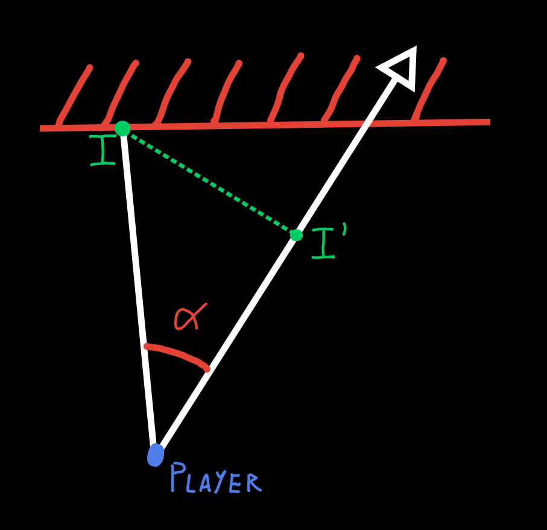

Our point I (Intersection) is at a certain angle $\alpha$ but the player is not looking that way. -->

To better imagine this problem let's image a room perfectly round. You would see like this, right ?

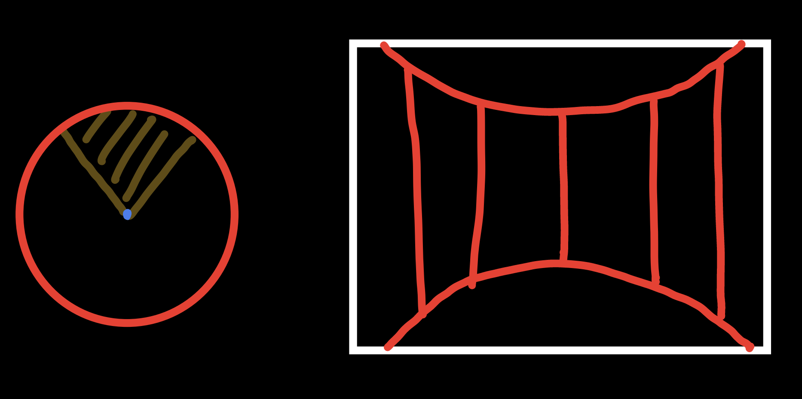

but in our current algorythm it will look like this :

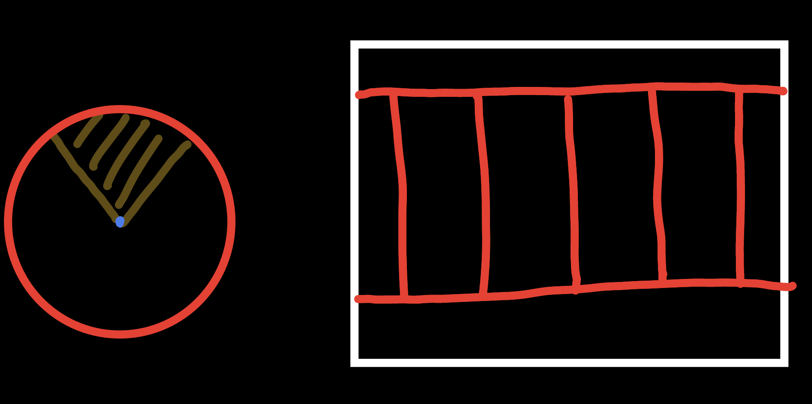

because, we define that our wall height is proportional to the distance of that wall and in a circle, every wall is at the same distance so we will have a flat rectangle wall.

This is because our distance should not be the distance directly the orthogonal projection of our point I on the axe of the player direction. 


$I$ : Intersection  
$I'$ : Orthogonal projection of intersection on the axe of the player direction

With the graph, it may be easier. To simplify, the distance we want is not $\overline{PI}$ but $\overline{PI'}$

<details open><summary>Math Explanations</summary><blockquote> 

*(I'll use Matt Godbolt's exellent explonation in [his video](https://youtu.be/eOCQfxRQ2pY?t=607))*

First, let's see what we have in this problem

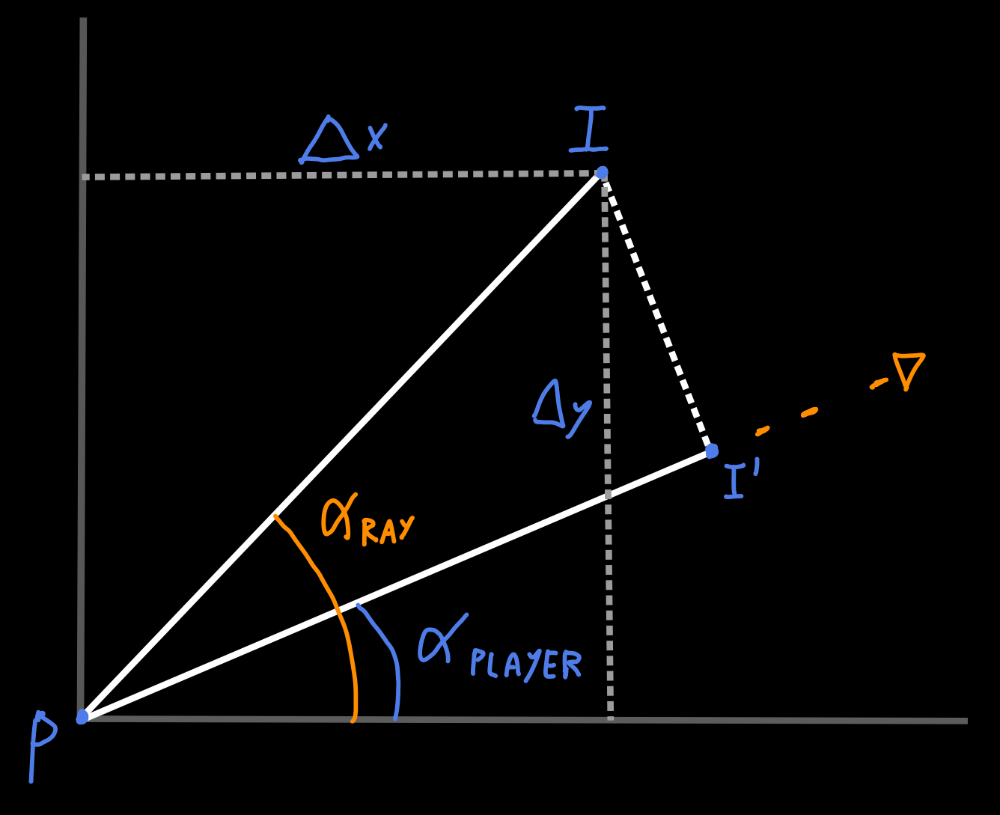

$$I = (\Delta x,\Delta y)$$

$\Delta x$ is the x coordinate of our intersection.  
$\Delta y$ is the y coordinate of our intersection.  

$$\overline{PI'} = \overline{PI}.cos(\alpha_{ray} - \alpha_{player})$$

With the formula : 
$$cos(\alpha - \beta) = cos(\alpha).cos(\beta) + sin(\alpha).sin(\beta)$$

We have then :
$$\overline{PI'} = \overline{PI}.[cos(\alpha_{ray}).cos(\alpha_{player}) + sin(\alpha_{ray}).sin(\alpha_{player})]$$
$$\overline{PI'} = \overline{PI}.cos(\alpha_{ray}).cos(\alpha_{player}) + \overline{PI}.sin(\alpha_{ray}).sin(\alpha_{player})$$

but we with basic trigonometry, we can find that :
$$\Delta x = \overline{PI}.cos(\alpha_{ray})$$
$$\Delta y = \overline{PI}.sin(\alpha_{ray})$$

and so in our formula, we have :

$$\overline{PI'} = \Delta x.cos(\alpha_{player}) + \Delta y.sin(\alpha_{player})$$

With this we have simplified our formula with only known elements. So now :

$$Dist_{Wall} = \Delta x.cos(\alpha_{player}) + \Delta y.sin(\alpha_{player})$$

</blockquote></details>


<details open><summary>Program Explanations</summary><blockquote> 

```c
typedef struct s_point
{
	float x;
	float y;
}	t_point;

t_point player;
float player_alpha;

float get_distance(t_point inter)
{
	return (abs(player.x - inter.x) * cos(player_alpha)
		  + abs(player.y - inter.y) * sin(player_alpha));
}
```

yeah, i don't have an explonation for that :|

</blockquote></details>

Now the we have fixed that, we finally have the wall working well. (Or at least I hope).

---

# 4. The floor, the ceiling and the skybox


x  
x  
x  
x  

---

# 5. Transparency ?!?

x  
x  
x  
x  


---

# 6. Sources

- Make Your Own Raycaster [Part 1](https://youtu.be/gYRrGTC7GtA), [Part 2](https://youtu.be/PC1RaETIx3Y) and [Part 3](https://youtu.be/w0Bm4IA-Ii8) by 3DSage
- [Wolfenstein 3D's map renderer](https://youtu.be/eOCQfxRQ2pY) by Matt Godbolt
- [Ray casting fully explained. Pseudo 3D game](https://youtu.be/g8p7nAbDz6Y) by WeirdDevers
- [Raycaster engine - Floors and Ceilings](https://orbb.neocities.org/tutorials/rayfloor/rayfloor.html)

