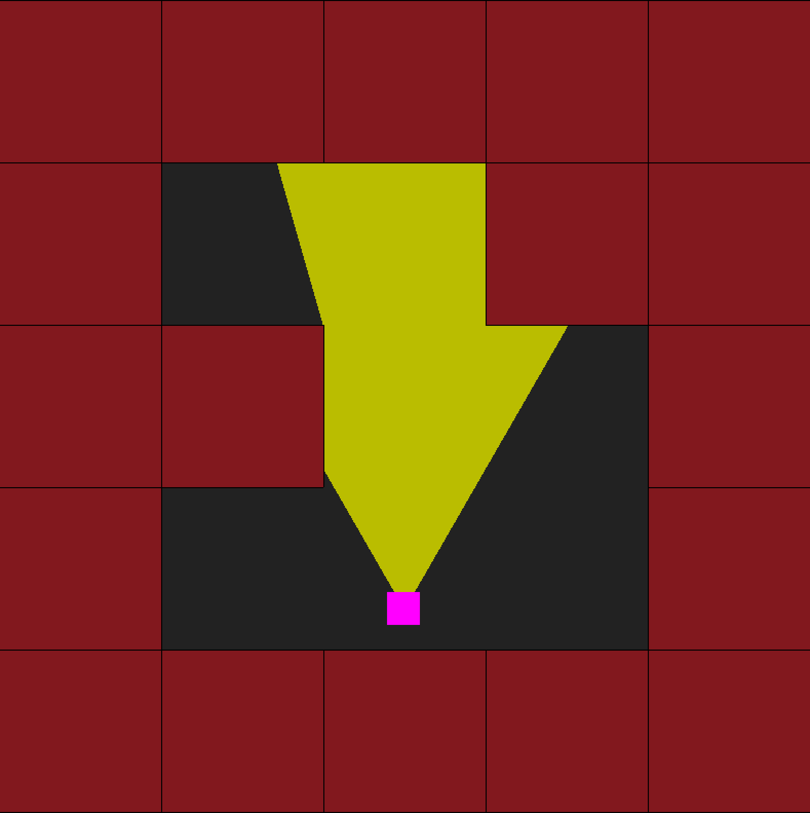
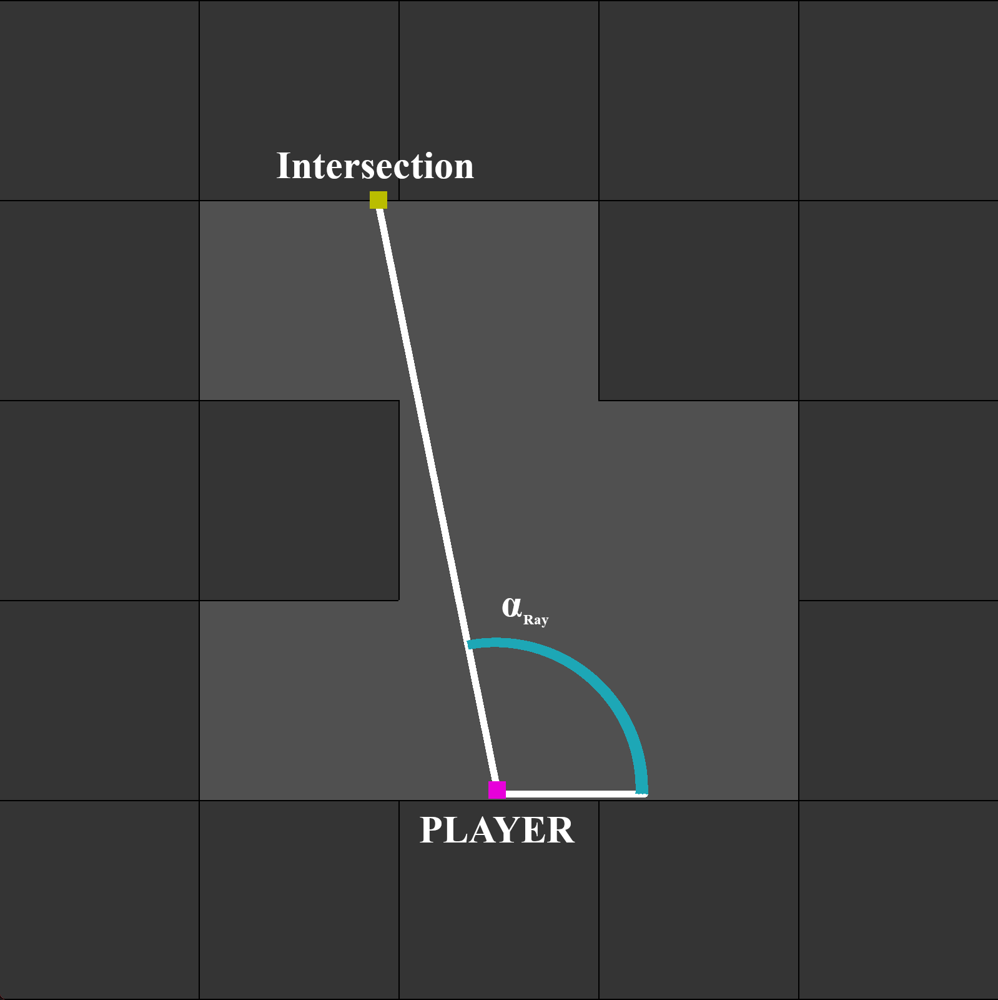
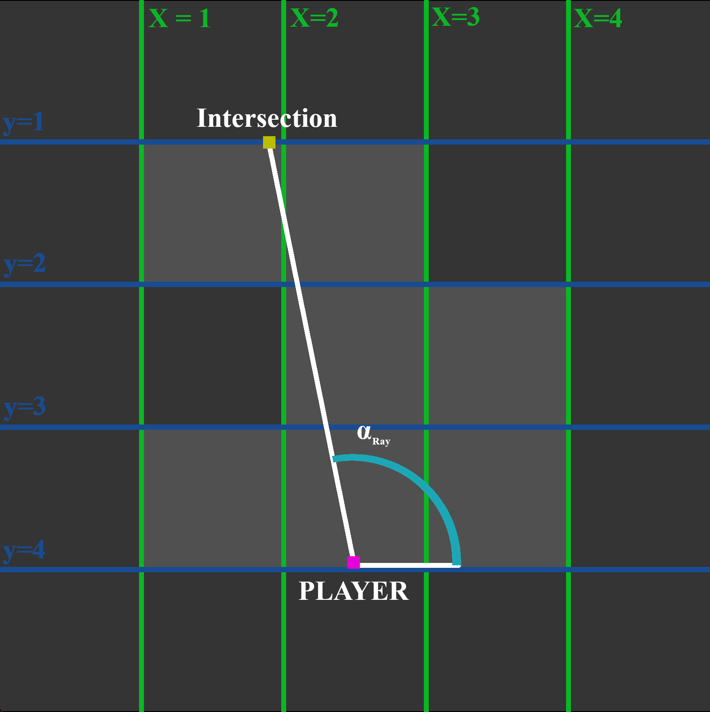
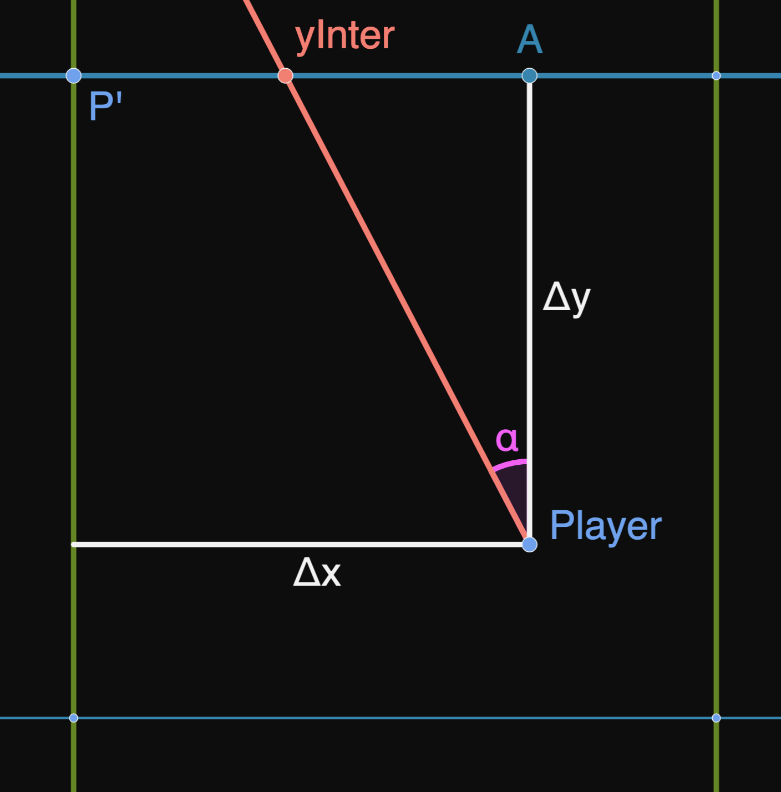
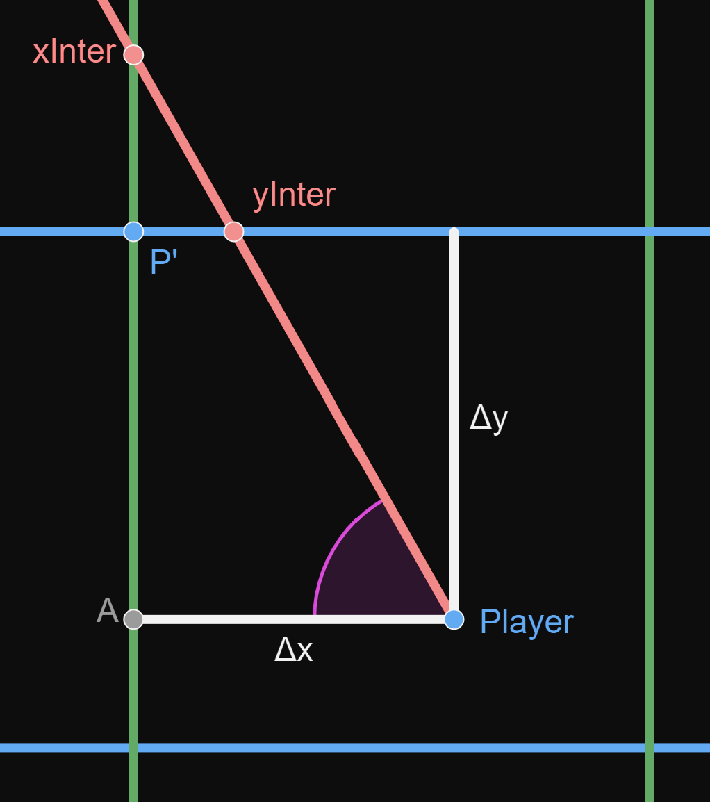
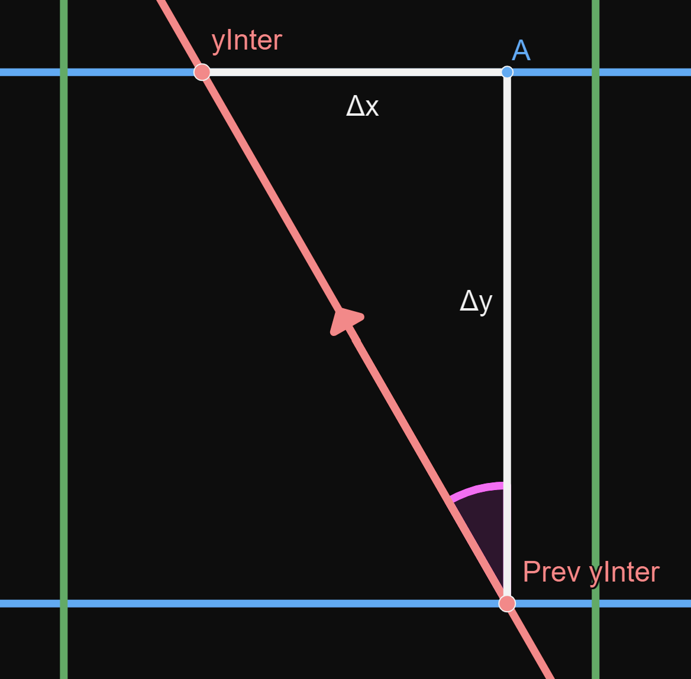
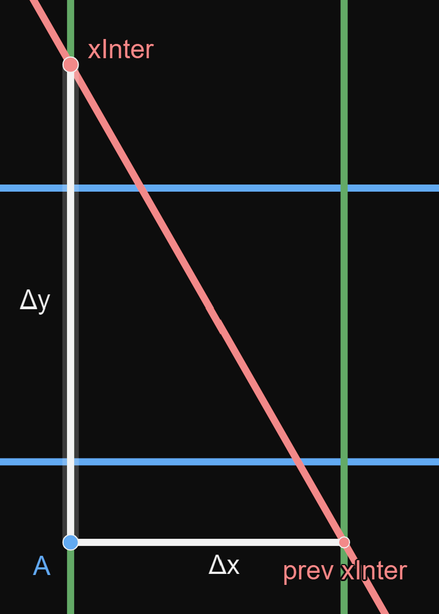

---

# Ray Casting Explonation

## Disclaimer

In this documentation, I'm going to explain the logic I found for a simple ray caster.
This is in now way the most optimised version but it's what worked and what i understood.  
My english is not best so sorry in advance if it's not clear.  
With that out of the way, let's start.

--- 

# Table of Content

1. [The basic idea, Ray casting at it's core](#1.-the-basic-idea,-ray-casting-at-it's-core)
2. [A 2d map game with a flashlight](#2.-a-2d-map-game-with-a-flashlight)
3. [Let's add walls](#3.-let's-add-walls)
4. [The floor, the ceiling and the skybox](#4.-the-floor,-the-ceiling-and-the-skybox)
5. [***(bonus)*** Transparency ?!?](#5.-transparency-?!?)
6. [Sources and inspirations](#6.-sources)

---

# 1. The basic idea, Ray casting at it's core

Ray casting is method of generating a 2.5D world. *(2.5D : A game that looks 3D but can only be played in 2D)*  
It is a simplification of Ray tracing where Ray tracing calculates for each pixel the direction of light coming in, in contrast a ray caster puts limitation in the world to simplify the calculations so it can calculate only column by column instead of pixel by pixel.

The two limitation put the world is that the game is in 2 dimensions and that the world is subdivised in squares.  
That is because we will simplify the 3d to be a renderer of a 2d game that we will stretch so that 3d wall can appear.

<!-- It may appear still a bit confusing but don't worry it's only a vague explonation, we'll go into the detail in the later chapters.  
All you need to know is the general process of the ray caster which is : -->

---

# 2. A 2d map game with a flashlight

The first step in our advendture towards 3d is to draw a single line accross the screen with all the intersection of the wall a the middle point. Seems complicated but it's not. It's is simply that for each pixel you get the intersection of the wall and print the corresponding texture of the given wall. The keyword in the last sentence being interscetion.  
The first step of our ray caster will be to get the intersection of a wall given a player position and player angle.

This can be difficult to visualize so instead of going straight in 3d will do a detour towards 2d to draw a flashlight for a 2d game. It essencially the same thing as for this game we would need to draw the map then draw the light emitted by the flash light until it intersect with a wall.



For simplification, we will divide the task in small task and draw only a single ray instead of a lot for a flash light.


Our ray can be even more simplified as a line between a two points.



What we want to find is $(X_{inter}, Y_{inter})$, the coordinates of Intersection.

We know :  
- $(X_{player}, Y_{player})$, the coordinates of the player  
- $\alpha_{ray}$, the direction of the ray  

To find the intersection, we will use the rules we set earlier. We know the map is a grid so that mean our intersction is on one of the edge of a square.  
That means that the point intersection has to be on either horizontal line with a round $y$ or a vertical line with a round $x$.

So intersection is either on a blue line or green line.



That does mean we can divide our process in two: xIntercept and yIntercept.

We alse can subdivide the process in two major section. The first occurence and all the one after.

## Math notations

Quickly before the math comes in,

$\begin{pmatrix}x \\y\end{pmatrix}$ is the notation for a set of coordinate.

$\overline{AB}$ is the distance between $A$ and $B$.  
$A_x$ is the coordinate $x$ of the point $A$  
$A_y$ is the coordinate $y$ of the point $A$  
$inter(i)$ is the point represented by the function $inter()$ iterated a $i$ number of times  
$\pm$ is plus or minus

## yIntercept first step



<details open><summary>Definitions</summary><blockquote> 

$P'$ is a point in the corner of the square where the player is.  
$\Delta x$ is difference between $| P'_x - P_x|$  
$\Delta y$ is difference between $| P'_y - P_y|$  

**/!\ Warning /!\\**  
$P'$ position will vary in function in which direction the player faces.  
Then $\Delta x$ and $\Delta y$ will do so aswell.

</blockquote></details>

<details open><summary>Math Explonations</summary><blockquote> 

We need to find $yInter$ but we already know it's $y$ value, it is the same $y$ as $P'$.

So

$$yInter = (yInter_x, p'_y)$$

The only needed value then is $yInter_x$.

We can see that :

$$yInter_x = P'_y + \overline{P'\ yInter}$$

but we can see on the graph that

$$\overline{P'\ yInter} = \Delta x - \overline{A\ yInter}$$

so

$$yInter_x = P'_y + \Delta x - \overline{A\ yInter}$$

So to find $yInter_x$ we need to find $\overline{A\ yInter}$ which is convinently a side of the triangle formed by $yInter$, $Player$ and $A$.  


With $tan(\alpha) = \dfrac{opposite}{adjacent}$, we can determine that

$$\overline{A\ yInter} = \Delta y . tan(\alpha_{ray})$$

and so

$$yInter_x = P'_y + \Delta x - \Delta y . tan(\alpha_{ray})$$

but

$$P'_y + \Delta x = P_x$$

In conclusion, we have that

$$yInter = \begin{pmatrix}
P_x - \Delta y . tan(\alpha_{ray}) \\
P'_y
\end{pmatrix}$$

</blockquote></details>

<details open><summary>Program Explonations</summary><blockquote> 

Now that we know the formula to calculate the first point of intersection. We see that that we know $\alpha_{ray}$ and $P_x$ but only have a description of what $P'_y$ and $\Delta y$ are.

We know that in the example in our graph that $P'$ is simple equal to a cast to an integer of $P$

```c
float P_prime_y = (int) player_y;
```

But that only is the case when the player is looking to the North, or in more precise terms :   
$\alpha_{ray}$ is between $0^\circ$ and $180^\circ$ or between $0$ and $\pi$ radian. 

```c
if (0 < alpha_ray && alpha_ray <= 180)
	float P_prime_y = (int) player_y;
else
	float P_prime_y = (int) player_y + 1;
```

or a bit better

```c
float P_prime_y = (int) player_y;
if (180 < alpha_ray && alpha_ray <= 360)
	P_prime_y += 1;
```

We now know the value of $P'_y$. We only need $\Delta y$, for that we can simply use the formula in the definitions.

```c
float delta_y = abs(player_y - P_prime_y);
```

Now, we have everything to calculate yInter with our formula :  

$$yInter = \begin{pmatrix}
P_x - \Delta y . tan(\alpha_{ray}) \\
P'_y
\end{pmatrix}$$

```c
float yInter_x = player_x - delta_y * tan(alpha_ray);
float yInter_y = P_prime_y;
```

We finally have the first point of intersection to a line where y is round.

</blockquote></details>

## xIntercept first step

The math explonation are almost the same as yInter init but some value exchanged. So I'll answer one the question you may have is that if the first intersection is out of the first square.  
You'll see it works the same.  
<!-- The only thing you need to know before hand is that a distance $\overline{AB}$ can go in the negative. -->



<details open><summary>Definitions</summary><blockquote> 

$P'$ is a point in the corner of the square where the player is.  
$\Delta x$ is difference between $| P'_x - P_x|$  
$\Delta y$ is difference between $| P'_y - P_y|$  

**/!\ Warning /!\\**  
$P'$ position will vary in function in which direction the player faces.  
Then $\Delta x$ and $\Delta y$ will do so aswell.

</blockquote></details>

<details open><summary>Math Explonations</summary><blockquote> 


We need to find $xInter$ but we already know it's $x$ value, it is the same $x$ as $P'$.  
So 

$$xInter = (p'_x, xInter_y)$$  

The only needed value then is $xInter_y$.

We can see that :  
$$xInter_y = P'_y - \overline{P'\ xInter}$$

but we can see on the graph that

$$\overline{P'\ xInter} = \overline{A\ xInter} - \Delta y$$ 

so

$$xInter_y = P'_x - (\overline{A\ xInter} - \Delta y)$$

*The trick for if it's outside is here. With a double negative the formula can be simplified.*

$$xInter_y = P'_x + \Delta y - \overline{A\ xInter}$$

So to find $xInter_y$ we need to find $\overline{A\ xInter}$ which is convinently a side of the triangle formed by $xInter$, $Player$ and $A$.  


With $tan(\alpha) = \dfrac{opposite}{adjacent}$, we can determine that  
$$\overline{A\ xInter} = \dfrac{\Delta x}{tan(\alpha_{ray})}$$  
and so  
$$xInter_y = P'_x + \Delta y - \dfrac{\Delta x}{tan(\alpha_{ray})}$$

but
$$P'_y + \Delta y = P_y$$

In conclusion, we have that  

$$xInter = \begin{pmatrix}
P'_x \\
P_y - \dfrac{\Delta x}{tan(\alpha_{ray})}
\end{pmatrix}$$

</blockquote></details>

<details open><summary>Program Explonations</summary><blockquote> 

Now that we know the formula to calculate the first point of intersection. We see that that we know $\alpha_{ray}$ and $P_x$ but only have a description of what $P'_x$ and $\Delta x$ are.

We know that in the example in our graph that $P'$ is simple equal to a cast to an integer of $P$

```c
float P_prime_x = (int) player_x;
```

But that only is the case when the player is looking to the West, or in more precise terms :   
$\alpha_{ray}$ is between $90^\circ$ and $270^\circ$ or between $\dfrac{\pi}{2}$ and $\dfrac{3\pi}{2}$ radian. 

```c
if (90 < alpha_ray && alpha_ray <= 270)
	float P_prime_x = (int) player_x;
else
	float P_prime_x = (int) player_x + 1;
```

or a bit better

```c
float P_prime_x = (int) player_x;
if (!(90 < alpha_ray && alpha_ray <= 270))
	P_prime_x += 1;
```

We now know the value of $P'_x$. We only need $\Delta x$, for that we can simply use the formula in the definitions.

```c
float delta_x = abs(player_x - P_prime_x);
```

Now, we have everything to calculate xInter with our formula :  

$$xInter = \begin{pmatrix}
P'_x \\
P_y - \dfrac{\Delta x}{tan(\alpha_{ray})}
\end{pmatrix}$$

```c
float xInter_x = P_prime_x;
float xInter_y = player_y - delta_x * tan(alpha_ray);
```

We finally have the first point of intersection to a line where x is round.

</blockquote></details>

## Get Next Step

Now that we have found the first intersection for both $x$ and $y$ axis, we need to create a function that take an intersection and gets you the next one for both axis.

## get yIntercept next step


 
<details open><summary>Definitions</summary><blockquote> 

For readability, i will refer to :  
- "yInter" as $yInter(i)$  
- "prev yInter" as $yInter(i + 1)$

$\Delta x$ is difference between $| yInter(i)_x - yInter(i+1)_x |$  
$\Delta y$ is difference between $| yInter(i)_y - yInter(i+1)_y |$  

</blockquote></details>

<details open><summary>Math Explonations</summary><blockquote> 

We need to get $yInter(i+1)$ and we know $yInter(i)$ and $\alpha_{ray}$

We can see on the graph that :  

$$yInter(i+1) = \begin{pmatrix}
yInter(i)_x - \Delta x \\
yInter(i)_y - \Delta y
\end{pmatrix}$$

but that is only valid if we are looking North-West. The sign of both $\Delta$ will vary in function of the angle we are looking at. I'm going to make the function with a $\pm$ but in the program section we will solve this issue.

We have then :  
$$yInter(i+1) = \begin{pmatrix}
yInter(i)_x \pm \Delta x \\
yInter(i)_y \pm \Delta y
\end{pmatrix}$$

We need to calculate both $\Delta$ but we can see that $\Delta y$ is equal to $1$ which makes sense because we need to find the next intersection with the line where $y = a + 1$ from the intersection with the line where $y = a$.

So the only value missing is $\Delta x$ but we can it inside triangle made by the point $A$, $yInter(i)$ and $yInter(i+1)$. So we can use our favorite trick : trigonometry.  


With $tan(\alpha) = \dfrac{opposite}{adjacent}$, we can determine that 

$$\Delta x = \Delta y . tan(\alpha_{ray})$$

With that done, we now know that

$$yInter(i+1)_x = yInter(i+1)_x \pm \Delta y . tan(\alpha_{ray})$$

but earlier we said that $\Delta y = 1$, so

$$yInter(i+1)_x = yInter(i+1)_x \pm tan(\alpha_{ray})$$

And finally, 

$$yInter(i+1) = \begin{pmatrix}
yInter(i)_x \pm tan(\alpha_{ray}) \\
yInter(i)_y \pm 1
\end{pmatrix}$$

</blockquote></details>

<details open><summary>Program Explonations</summary><blockquote> 

We now have the formula to get the next intersection of line where y is round. But to compute it we have to get rid of this $\pm$.

For that we observe that we need to subtract $\Delta x$ if we are looking in the west and add if we are looking east.  
The west being if $\alpha_{ray}$ is between $90^\circ$ and $270^\circ$ or between $\dfrac{\pi}{2}$ and $\dfrac{3\pi}{2}$ radian.

We will use this knowledge and our formula to cumpute it.

$$yInter(i+1)_x = yInter(i)_x \pm tan(\alpha_{ray})$$

```c
float deltaX = tan(alpha_ray);

if (90 < alpha_ray && alpha_ray <= 270)
	float yInter_next_x = yInter_prev_x - deltaX;
else
	float yInter_next_x = yInter_prev_x + deltaX;
```

We have the $x$, now we need the $y$ except this time we add if we are looking south and substract if we are looking north.  
The north being if $\alpha_{ray}$ is between $0^\circ$ and $180^\circ$ or between $0$ and $\pi$ radian.

And with our formula, 

$$yInter(i+1)_y = yInter(i)_y \pm 1$$

```c
if (0 < alpha_ray && alpha_ray <= 180)
	float yInter_next_y = yInter_prev_y - 1;
else
	float yInter_next_y = yInter_prev_y + 1;
```

With that done we have have finished a step.

</blockquote></details>


## get xIntercept next step


 
<details open><summary>Definitions</summary><blockquote> 

For readability, i will refer to :  
- $xInter$ as $xInter(i)$  
- $prev\ xInter$ as $xInter(i + 1)$

$\Delta x$ is difference between $| xInter(i)_x - xInter(i+1)_x |$  
$\Delta y$ is difference between $| xInter(i)_y - xInter(i+1)_y |$  

</blockquote></details>

<details open><summary>Math Explonations</summary><blockquote> 

We need to get $xInter(i+1)$ and we know $xInter(i)$ and $\alpha_{ray}$

We can see on the graph that :  

$$xInter(i+1) = \begin{pmatrix}
xInter(i)_x - \Delta x \\
xInter(i)_y - \Delta y
\end{pmatrix}$$

but that is only valid if we are looking North-West. The sign of both $\Delta$ will vary in function of the angle we are looking at. I'm going to make the function with a $\pm$ but in the program section we will solve this issue.

We have then :  
$$xInter(i+1) = \begin{pmatrix}
xInter(i)_x \pm \Delta x \\
xInter(i)_y \pm \Delta y
\end{pmatrix}$$

We need to calculate both $\Delta$ but we can see that $\Delta x$ is equal to $1$ which makes sense because we need to find the next intersection with the line where $x = a + 1$ from the intersection with the line where $x = a$.

So the only value missing is $\Delta x$ but we can it inside triangle made by the point $A$, $xInter(i)$ and $xInter(i+1)$. So we can use our favorite trick : trigonometry.  


With $tan(\alpha) = \dfrac{opposite}{adjacent}$, we can determine that 

$$\Delta y = \dfrac{\Delta x}{tan(\alpha_{ray})}$$

With that done, we now know that

$$xInter(i+1)_y = xInter(i+1)_y \pm \dfrac{\Delta x}{tan(\alpha_{ray})}$$

but earlier we said that $\Delta y = 1$, so

$$xInter(i+1)_y = xInter(i+1)_y \pm \dfrac{1}{tan(\alpha_{ray})}$$

And finally, 

$$xInter(i+1) = \begin{pmatrix}
xInter(i)_x \pm 1 \\
xInter(i+1)_y \pm \dfrac{1}{tan(\alpha_{ray})}
\end{pmatrix}$$

</blockquote></details>

<details open><summary>Program Explonations</summary><blockquote> 

We now have the formula to get the next intersection of line where y is round. But to compute it we have to get rid of this $\pm$.

For that we observe that we need to subtract $\Delta x$ if we are looking in the west and add if we are looking east.  
The west being if $\alpha_{ray}$ is between $90^\circ$ and $270^\circ$ or between $\dfrac{\pi}{2}$ and $\dfrac{3\pi}{2}$ radian.

We will use this knowledge and our formula to cumpute it.

$$xInter(i+1)_x = xInter(i)_x \pm 1$$

```c
if (90 < alpha_ray && alpha_ray <= 270)
	float xInter_next_x = xInter_prev_x - 1;
else
	float xInter_next_x = xInter_prev_x + 1;
```

We have the $x$, now we need the $y$ except this time we add if we are looking south and substract if we are looking north.  
The north being if $\alpha_{ray}$ is between $0^\circ$ and $180^\circ$ or between $0$ and $\pi$ radian.

And with our formula, 

$$xInter(i+1)_y = xInter(i+1)_y \pm \dfrac{1}{tan(\alpha_{ray})}$$

```c
float deltaY = 1 / tan(alpha_ray)

if (0 < alpha_ray && alpha_ray <= 180)
	float xInter_next_y = xInter_prev_y - deltaY;
else
	float xInter_next_y = xInter_prev_y + deltaY;
```

With that done we have have finished a another step.

</blockquote></details>

---

# 3. Let's add walls

x  
x  
x  
x  

---

# 4. The floor, the ceiling and the skybox

x  
x  
x  
x  

---

# 5. Transparency ?!?

x  
x  
x  
x  


---

# 6. Sources

- Make Your Own Raycaster [Part 1](https://youtu.be/gYRrGTC7GtA), [Part 2](https://youtu.be/PC1RaETIx3Y) and [Part 3](https://youtu.be/w0Bm4IA-Ii8) by 3DSage
- [Wolfenstein 3D's map renderer](https://youtu.be/eOCQfxRQ2pY) by Matt Godbolt
- [Ray casting fully explained. Pseudo 3D game](https://youtu.be/g8p7nAbDz6Y) by WeirdDevers
- [Raycaster engine - Floors and Ceilings](https://orbb.neocities.org/tutorials/rayfloor/rayfloor.html)

