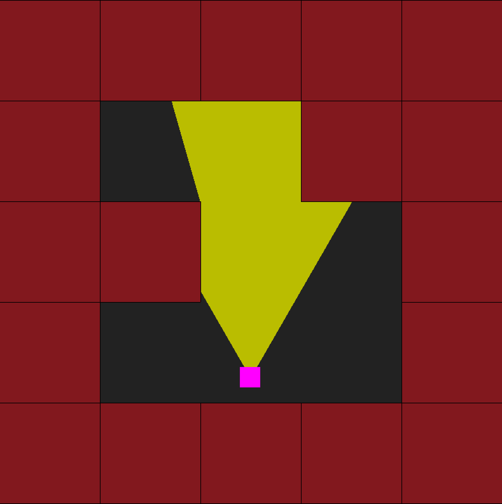
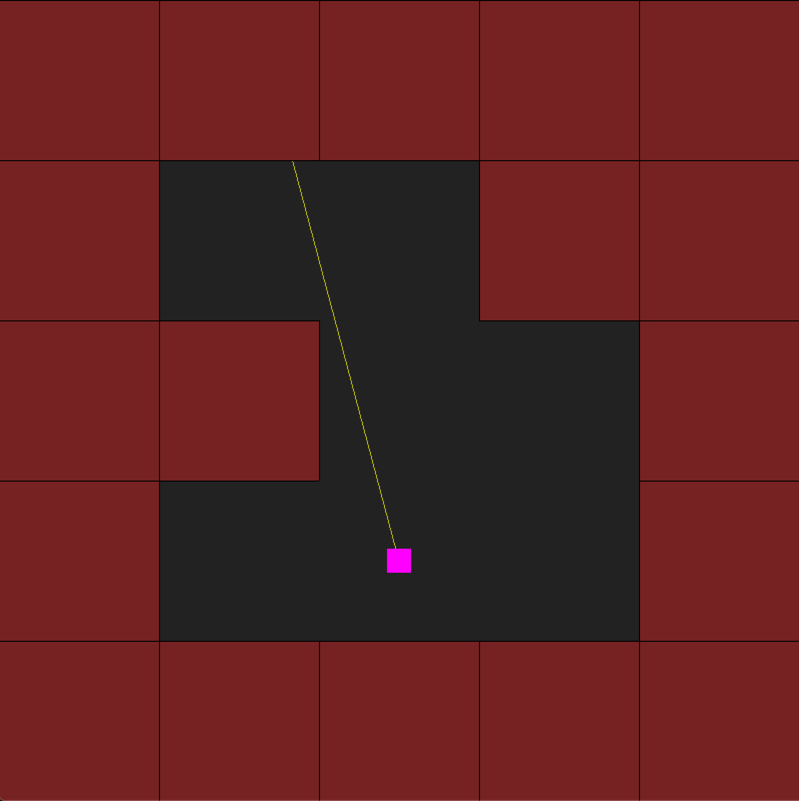
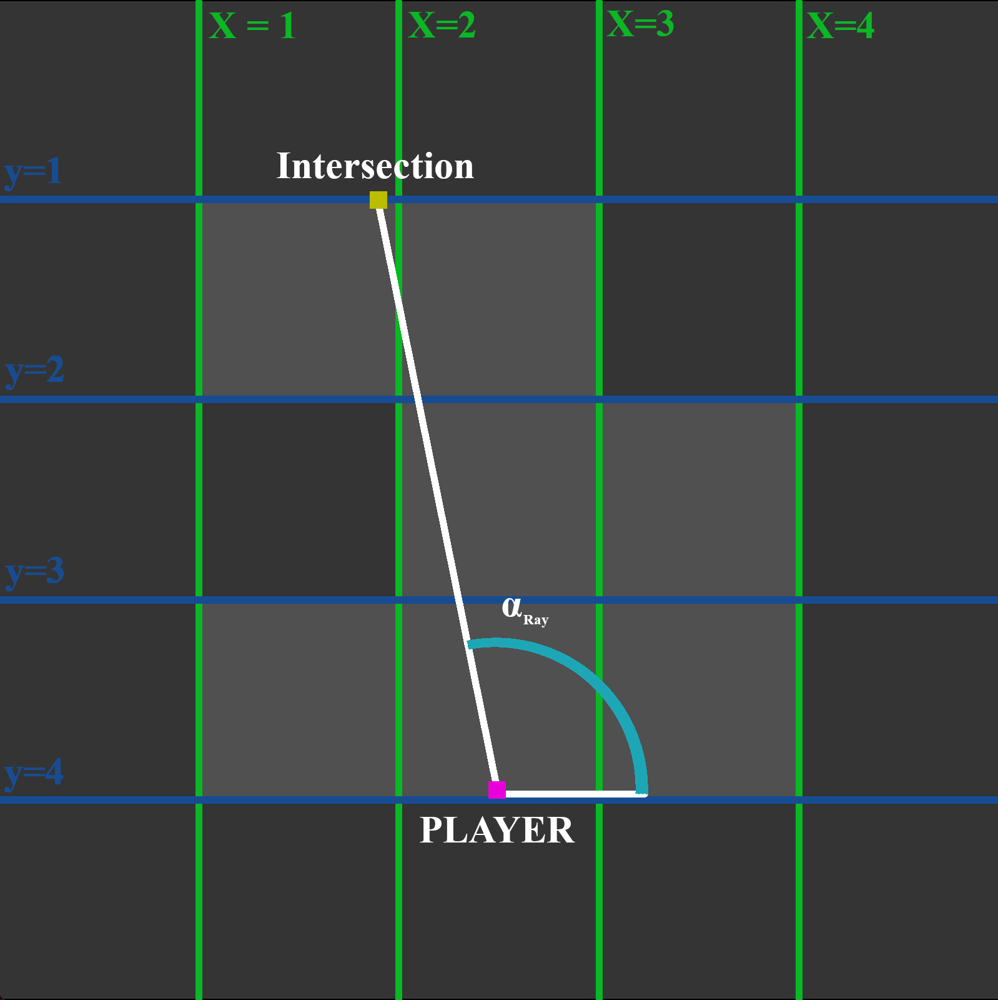
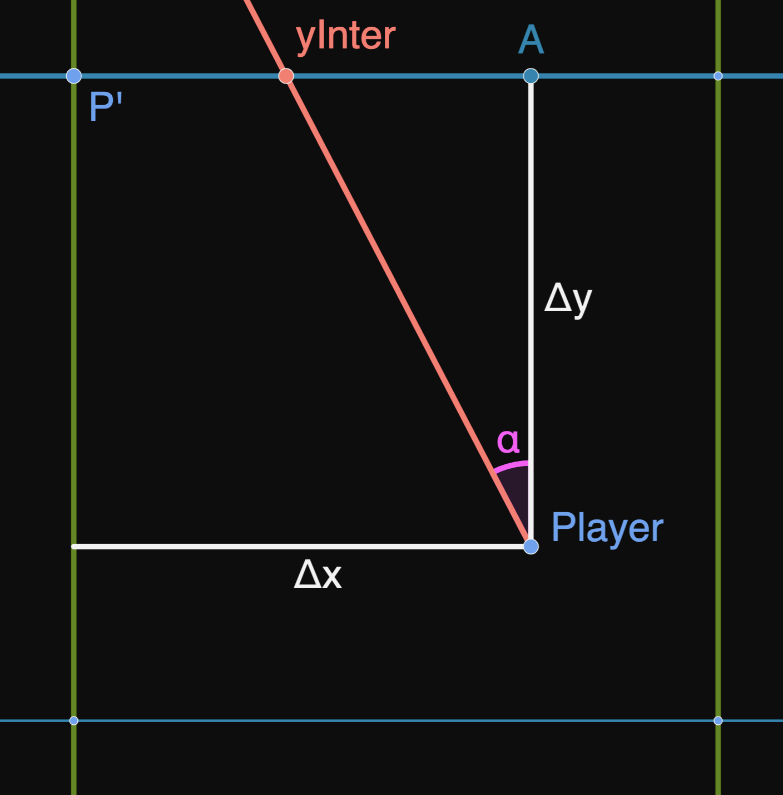
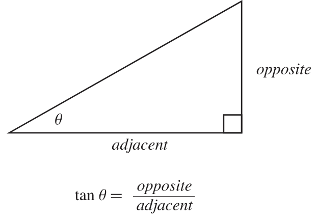

---

# Ray Casting Explonation

## Disclaimer

In this documentation, I'm going to explain the logic I found for a simple ray caster.
This is in now way the most optimised version but it's what worked and what i understood.  
My english is not best so sorry in advance if it's not clear.  
With that out of the way, let's start.

--- 

# Table of Content

1. [The basic idea, Ray casting at it's core](#1.-the-basic-idea,-ray-casting-at-it's-core)
2. [A 2d map game with a flashlight](#2.-a-2d-map-game-with-a-flashlight)
3. [Let's add walls](#3.-let's-add-walls)
4. [The floor, the ceiling and the skybox](#4.-the-floor,-the-ceiling-and-the-skybox)
5. [***(bonus)*** Transparency ?!?](#5.-transparency-?!?)
6. [Sources and inspirations](#6.-sources)

---

# 1. The basic idea, Ray casting at it's core

Ray casting is method of generating a 2.5D world. *(2.5D : A game that looks 3D but can only be played in 2D)*  
It is a simplification of Ray tracing where Ray tracing calculates for each pixel the direction of light coming in, in contrast a ray caster puts limitation in the world to simplify the calculations so it can calculate only column by column instead of pixel by pixel.

The two limitation put the world is that the game is in 2 dimensions and that the world is subdivised in squares.  
That is because we will simplify the 3d to be a renderer of a 2d game that we will stretch so that 3d wall can appear.

<!-- It may appear still a bit confusing but don't worry it's only a vague explonation, we'll go into the detail in the later chapters.  
All you need to know is the general process of the ray caster which is : -->

---

# 2. A 2d map game with a flashlight

The first step in our advendture towards 3d is to draw a single line accross the screen with all the intersection of the wall a the middle point. Seems complicated but it's not. It's is simply that for each pixel you get the intersection of the wall and print the corresponding texture of the given wall. The keyword in the last sentence being interscetion.  
The first step of our ray caster will be to get the intersection of a wall given a player position and player angle.

This can be difficult to visualize so instead of going straight in 3d will do a detour towards 2d to draw a flashlight for a 2d game. It essencially the same thing as for this game we would need to draw the map then draw the light emitted by the flash light until it intersect with a wall.

For simplification, we will divide the task in small task and draw only a single ray instead of a lot for a flash light.

Our ray can be even more simplified as a line between a two points.

What we want to find is $(X_{inter}, Y_{inter})$, the coordinates of Intersection.

We know :  
- $(X_{player}, Y_{player})$, the coordinates of the player  
- $\alpha_{ray}$, the direction of the ray  

To find the intersection, we will use the rules we set earlier. We know the map is a grid so that mean our intersction is on one of the edge of a square.  
That means that the point intersection has to be on either horizontal line with a round $y$ or a vertical line with a round $x$.

So intersection is either on a blue line or green line.

That does mean we can divide our process in two: xIntercept and yIntercept.

We will do for yIntercept first because we know the answer is yIntercept at the 3rd occurence.  
The first step is to find the first occurence with a little bit of math.

## yIntercept first step

We need to find $yInter$ but we already know it's $y$ value, it is the same $y$ as $P'$.  
So $yInter = (yInter_x, p'_y)$  
La seule valuer qu'il nous faut alor c'est $yInter_x$.

We can see that :  
$yInter_x = P'_x + \overline{P'\ yInter}$

but we can see on the graph that

$\overline{P'\ yInter} = \Delta x - \overline{A\ yInter}$

so

$yInter_x = P'_x + \Delta x - \overline{A\ yInter}$

So to find $yInter_x$ we need to find $\overline{A\ yInter}$ which is convinently a side of the triangle $||Player\ A\ yInter||$.  
With $tan(\alpha) = \dfrac{opposite}{adjacent}$

We can determine that
$\overline{A\ yInter} = \Delta y . tan(\alpha_{ray})$  
and so  
$yInter_x = P'_x + \Delta x - \Delta y . tan(\alpha_{ray})$

but $P'_x + \Delta x = P_x$

In conclusion, we have that $yInter = (P_x - \Delta y . tan(\alpha_{ray})\ ,\  P'_y)$. That is valid for every direction the player can see but $P'$, $\Delta y$ and $\Delta x$ can change in function which direction it is facing. 

---

# 3. Let's add walls

x  
x  
x  
x  

---

# 4. The floor, the ceiling and the skybox

x  
x  
x  
x  

---

# 5. Transparency ?!?

x  
x  
x  
x  

---

# 6. Sources

- Make Your Own Raycaster [Part 1](https://youtu.be/gYRrGTC7GtA), [Part 2](https://youtu.be/PC1RaETIx3Y) and [Part 3](https://youtu.be/w0Bm4IA-Ii8) by 3DSage
- [Wolfenstein 3D's map renderer](https://youtu.be/eOCQfxRQ2pY) by Matt Godbolt
- [Ray casting fully explained. Pseudo 3D game](https://youtu.be/g8p7nAbDz6Y) by WeirdDevers
- [Raycaster engine - Floors and Ceilings](https://orbb.neocities.org/tutorials/rayfloor/rayfloor.html)

